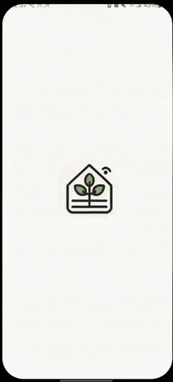
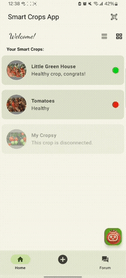
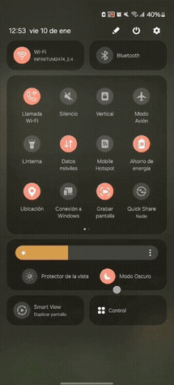

# Welcome to SmartCrops 🌱

[](https://developer.android.com/jetpack/compose)
[](https://kotlinlang.org/)

Welcome to the **SmartCrops** repository. This is an Android application prototype for monitoring and simulating a smart greenhouse system.

The project was developed as part of an interdisciplinary business and technology proposal during the Leader Formation Program at **Queen Mary University of London (QMUL)**. This repository focuses on the mobile application prototype and its proposed software features for crop monitoring, sensor visualization, disease detection, and user interaction.


<div align="center">
  <table align="center">
    <tr>
      <td align="center">
        <br>
        <sub>Crop Management</sub>
      </td>
      <td align="center">
        <br>
        <sub>Device Simulator</sub>
      </td>
      <td align="center">
        <br>
        <sub>Forum Feed</sub>
      </td>
      <td align="center">
        <br>
        <sub>Dark Mode</sub>
      </td>
    </tr>
  </table>
</div>

---

## 📚 About The Project

| Feature                | Details |
| ---------------------- | ------- |
| 🎯 **Purpose**         | A prototype to monitor crop conditions, simulate greenhouse variables, and provide crop-related assistance through the app. |
| ⚙️ **Architecture**     | Built with Jetpack Compose and a single-activity Android architecture. |
| 🤖 **Model/API Integration** | Includes TomaBot, a chatbot connected to the Gemini API for crop-related questions. |
| 🔗 **IoT Simulation**   | Simulates hardware integration through crop connection states, sensor views, and growth phase tracking. |

---

## 🚀 Tech Stack

### Android & UI


- **Kotlin & Jetpack Compose:** Used to build the main interface, crop views, chatbot screen, and interactive UI states.
- **CameraX:** Implemented for the hardware pairing screen, allowing users to scan QR codes on their physical SmartCrop devices.
- **Coil:** Asynchronous image loading for crop pictures and community forum feeds.

### API & Networking

- **OkHttp:** Used for asynchronous HTTP requests to the Gemini API.

---

## 🔧 Highlighted Features

| Feature | Description |
|--------|------------|
| **Crop Dashboard** | Displays crops with connection status, health state, and growth phase information. |
| **TomaBot** | Chat interface connected to the Gemini API for crop-related questions. |
| **Environmental Simulator** | Simulates variables such as temperature, humidity, pressure, oxygen level, and light intensity. |
| **Hardware Pairing** | Camera-based screen to simulate QR scanning and device linking. |
| **Community Forum** | Feed for sharing crop updates, comments, and interactions. |

---

## 🛠️ How to Run Locally

### 1. Clone the repository
```bash
git clone https://github.com/MexboxLuis/SmartCrops.git
cd SmartCrops
```

### 2. Open the project

Launch Android Studio, select **Open an existing project**, and navigate to the cloned `SmartCrops` folder.

### 3. API Key Configuration

For TomaBot testing:

1. Open `app/src/main/java/com/example/smartcropsapp/screens/TomaBotScreen.kt`
2. Locate the `apiKey` variable inside `sendMessageToGeminiApi`
3. Replace it with your own Gemini API key

### 4. Build and Run

Click **Sync Project with Gradle Files**.  
Once the build is successful, select your emulator or physical device (Android 8.0 / API 26+) and click **Run (Shift + F10)**.

> ⚠️ Note: The app will request Camera permissions when accessing the QR Scanner screen.

## 🔗 Project Info

| Resources | Team |
| --------- | ---- |
| [](docs/SmartCrops_Research_Bussiness.pdf) | Developed as part of an interdisciplinary team proposal during the Leader Formation Program at QMUL. This repository focuses on the mobile application prototype contribution. |